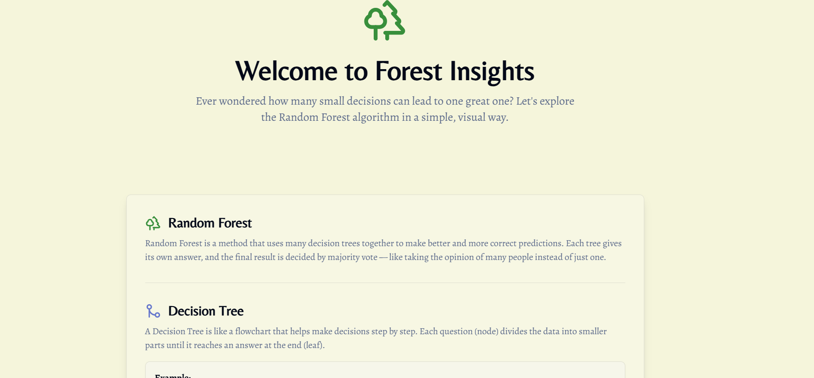
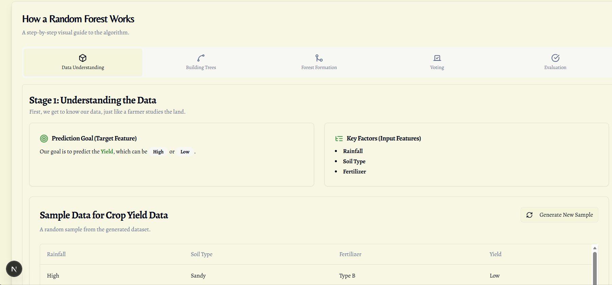
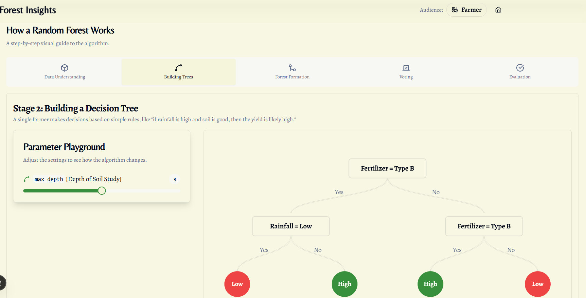
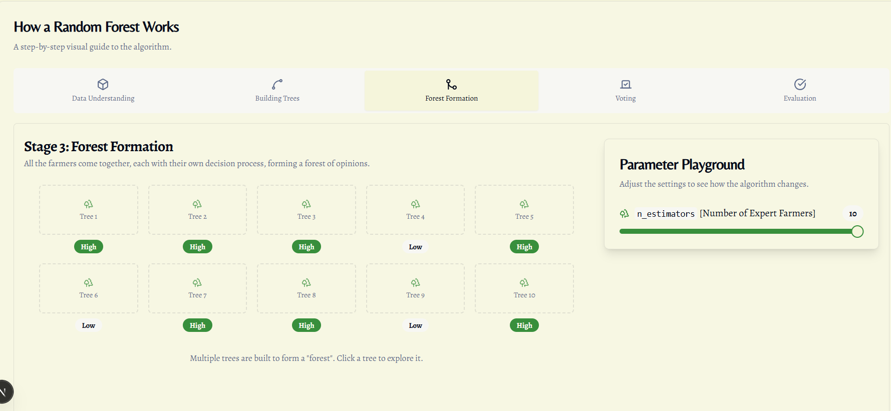
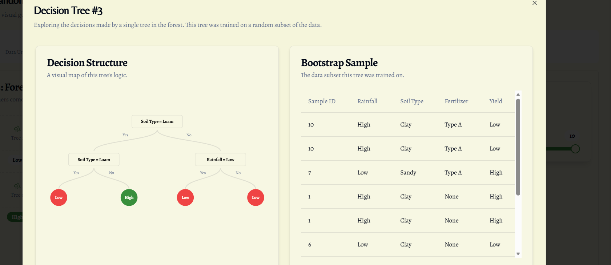
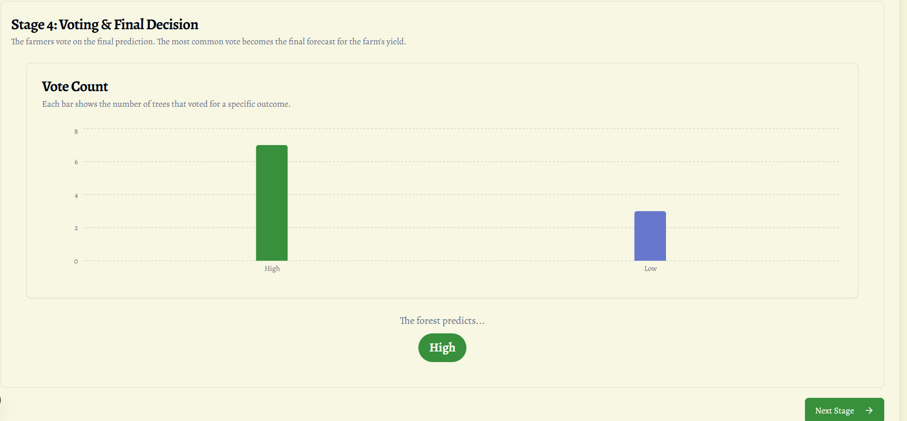
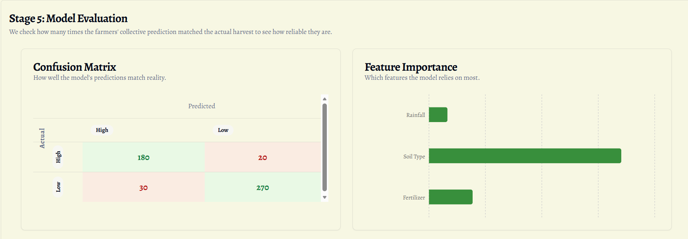
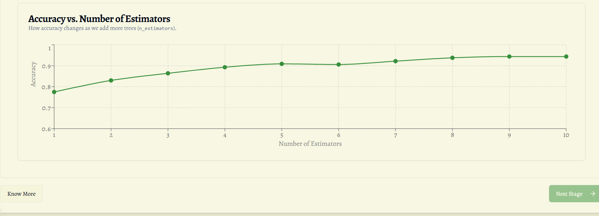

# 🌲 Forest Insights – A Visual & Story-Based Random Forest Learning Platform

Forest Insights is an **interactive educational web application** that explains the **Random Forest algorithm** through **simple stories, visuals, and intuitive step-by-step animations**.

Instead of technical terms and mathematical equations, users learn using:

- Clear examples  
- Visual decision trees  
- Forest voting animations  
- Parameter playgrounds  
- Real-world metaphors (farmer, soil, rainfall, yield, etc.)  

This makes Random Forests understandable for **students, beginners, and anyone curious about Machine Learning**.

---

🎯 **GitHub:**  
👉 [https://github.com/premkishan1215-maker/Random-Forest](https://github.com/premkishan1215-maker/Random-Forest)

---

## 🖼️ Project Preview

🧩 Beginner View

        

---

## 👥 Team Members

| Name | Role | Contribution |
|------|------|--------------|
|Aayush Trilok Jha | Developer | Implemented UI, Tree Visualization, Parameter Controls |
| Prem Kishan| Developer | Built Forest Formation & Voting Section |
| Pranjal Sahani | Data/Logic | Worked on Dataset Generation & Algorithm Logic |
|Pandey Ankit Anand | Designer | UI/UX, Icons, Animation Flow |

# 🏞️ Welcome to Forest Insights

The homepage introduces Random Forests in a simple way:

### 🌳 Random Forest
A method that uses **many decision trees working together** to make better decisions.  
Each tree gives its own answer, and the final result is based on **majority voting** — like taking the opinion of many people instead of one.

### 🌱 Decision Tree  
A simple step-by-step flowchart where each question splits data into smaller parts until a final answer is reached.

---

# 🧭 How the Random Forest Works  
The dashboard guides users through **4 main stages**, each of which is interactive and visually explained.

---

# 🧮 **Stage 1: Understanding the Data**

This stage introduces the dataset and prediction goal.

### 🎯 Prediction Goal  
The aim is to predict whether the **Yield** is **High** or **Low**.

### 🌿 Key Factors (Features)
- Rainfall  
- Soil Type  
- Fertilizer  

The page includes friendly explanations like:

> “First, we get to know our data, just like a farmer studies the land.”

Visual components include:
- Target description cards  
- Feature lists  
- Clean, readable layout  

---

# 🌳 **Stage 2: Building a Decision Tree**

This stage shows **how a single tree learns** from data.

### 🕹️ Parameter Playground  
Users can adjust:

- `max_depth` → **Depth of Soil Study**  
  (How deeply the tree studies the soil data before making a decision)

### 🌱 Visual Tree Growth  
A real decision tree is displayed on the right side, showing:

- Splitting conditions  
- Branch directions (Yes/No)  
- Final predictions (High/Low)  
- Colorful leaf nodes  

This brings the entire *logic* of the tree to life.

---

# 🌲 **Stage 3: Forest Formation**

This stage shows how **multiple trees together form a Random Forest**.

### 🌲 Tree Grid  
Your UI displays a grid of trees labeled:

- Tree 1  
- Tree 2  
- Tree 3  
- … up to Tree 10  

Each shows its output visually:

- 🟢 **High**  
- 🔴 **Low**

if you click on the tree it will show the diagram of that tree and data regarding the tree.

### 🕹️ Parameter Playground  
Users control:

- `n_estimators` → **Number of Expert Farmers**  
  (How many trees join the forest)

The forest updates live as the slider moves.

---

# 🗳️ **Stage 4: Voting**

Each tree casts a vote based on its prediction.

The UI shows:

- Green = High prediction  
- Red = Low prediction  
- A voting tally where the forest decides the final output  

The final result is chosen by **majority vote**, visually displayed to the user.

---

# 📊 **Stage 5: Evaluation**

This final stage explains:
- Accuracy  
- How Random Forest improves predictions  
- Why combining multiple trees helps  
- Easy metaphors to make ML concepts intuitive  

---

# 🧰 Tech Stack

| Component | Technology |
|----------|------------|
| Frontend Framework | **Next.js / React** |
| Styling | **Tailwind CSS** |
| Tree/Graph Visuals | Custom React components |
| State Management | React Hooks |
| Parameter Controls | Custom sliders + controlled components |

---

